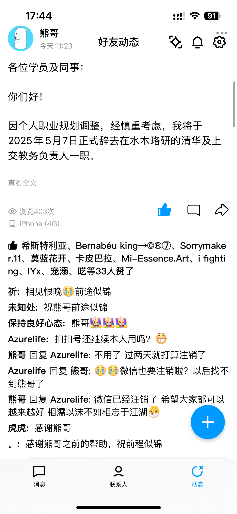
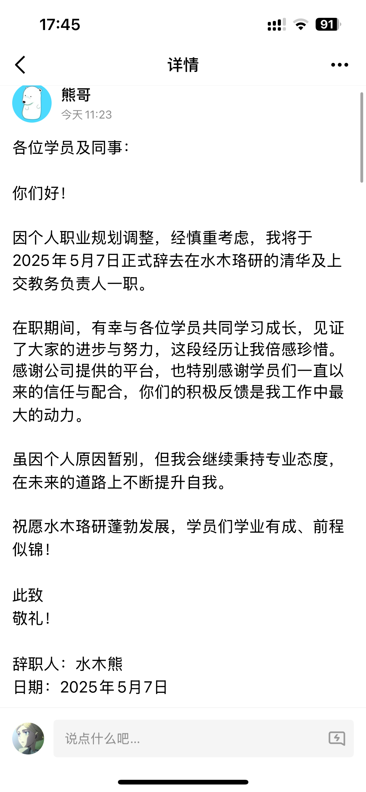

**仅以此篇文章来纪念我素未谋面的熊哥**

<!-- more -->

昨天傍晚，在从实验室去二餐的路上，我久违地打开了QQ空间，映入眼帘的是那个熟悉的头像，蓝色的水木熊，接下来便是一番致辞。是的，熊哥离职了。

<figure markdown>
  {width=300}
  <figcaption style="font-size: 0.9em; color: #666;">Figure: screenshot1</figcaption>
</figure>

<figure markdown>
  {width=300}
  <figcaption style="font-size: 0.9em; color: #666;">Figure: screenshot2</figcaption>
</figure>

这一消息对我来说又是惊讶，又是好奇，但其实更多的是感慨。我和熊哥的接触不多，上次互动还是微信朋友圈的某一次点赞，当然并不是互赞，因为熊哥根本不认识我，也可能很难记住我，我不出众，也不外向。

和熊哥的相识还要回到2022年的春天，那年我21岁，大三。大三是个关键的时候，大家都在忙着考研，我也不例外。当时我还在水木珞研的答疑大群里，没有选好院校，熊哥好像也刚刚入职。大家都知道的，这种线上考研机构很少有非常负责的学长，答疑不过是赚份外快，混混日子罢了。但熊哥不一样，从字里行间中我就看到了他的负责和那份较真的态度。

还有其他很多机缘巧合，最后我选择了考研上交大，能得到熊哥后续更加频繁的辅导。我挺喜欢熊哥的为人处世，他讲话很有趣，做事认真，答疑笔记字写的非常规范，可谓是答疑学长中的一股清流。可惜的是当时由于自己可怜的自尊心，并没有私下多去找熊哥进行深入的交流，关系也就于此了。

熊哥本科就读于中国矿业大学，大概2021年左右二战清华上岸，22年的时候成为了答疑学长。依稀在几次腾讯会议中熊哥吹逼到，当时电路哥对他的帮助很大，第二年给他减半了学费，因此上岸后在水木答疑帮忙，但时间久远，我也不记得真伪了。

记得当时刚上岸后，可能自己变得清高，目中无人了，觉得熊哥都上清华了没必要继续答疑，不如深造走向更加广阔的天空。后来入学后，太多的变故让我倍感失望，发掘考研机构也没什么不好的，挣钱才是硬道理，后面熊哥人设立住了，配合上一本自己编写的电路原理笔记总结$\LaTeX$版本，绝对能在管理层扎根，不进电网也能赚个盆满钵满。别人赚钱我眼馋，熊哥如果能发展成这样那真是他应得的。

后来我也做了考研答疑，电路一对一辅导，导师的电路理论助教也当了两次，每次忘记相关知识点时都会拿出来当时跟着熊哥做的每日一题笔记。还记得有次在Anna's Archive上搜书的时候也发现了熊哥的考研电路笔记，不由得会心一笑，像他那么标志性的笔记，看上一眼就不会忘记。
<figure markdown>
  
  <figcaption style="font-size: 0.9em; color: #666;">Figure: 在Anna's Archive上偶然看到熊哥的电路原理考研笔记</figcaption>
</figure>

熟悉熊哥的人都知道，最开始的时候他是浣熊君头像，后面才变成了蓝色的水木熊。熊哥在电路理论方面有着独到的见解，也曾多次再讲题中用他熟悉的口音吹逼或者说下经典名句。我很喜欢他讲话，还把一些经典语录记在了笔记上。

<figure markdown>
  {width=300}
  <figcaption style="font-size: 0.9em; color: #666;">Figure: 当年自己的笔记封面，还有熊哥的经典语录，甚是中二啊哈哈</figcaption>
</figure>

考完研后，没人再去关注这个圈子的一举一动，所有人又走在了新的路途上，准备面临着下一个抉择，我也逃不掉。如今三年过去了，我幻想着熊哥会全职在水木干很多年。但难以预料的是他决定要离职了。

我不知道这是好事还是坏事，我也不知道熊哥有什么打算，但看到熊哥的回复感觉他很洒脱，想必会有更好的路吧。

是的，不必留恋也不必难过，我们都有各自的选择。

是的，相濡以沫，不如相忘于江湖。

祝愿熊哥前程似锦。

